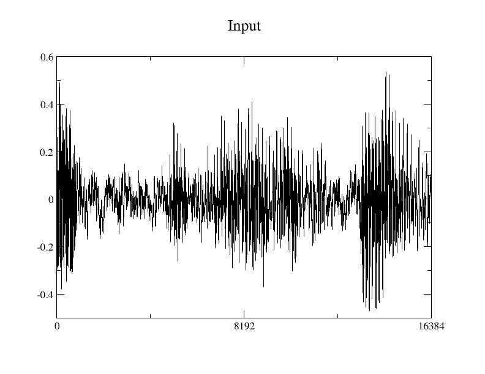
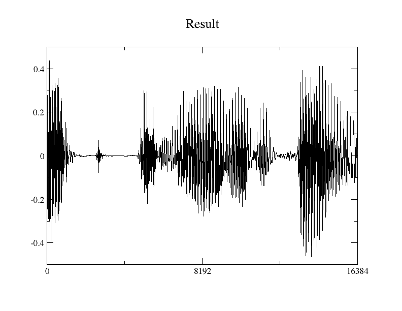

# Speech Enhancement Auto-Encoder in C
This code only supports inference, and shares same structure with [SEAE](https://github.com/MaruchanPark/SEAE)
## Usage:
### Inference

* 16bit signed integer input is normalized into 32bit floating point(-1 ~ 1).

compile
```
gcc enhance_verified.c -lm
```

execution
```
./a.out > result.txt&
```

Result

 
